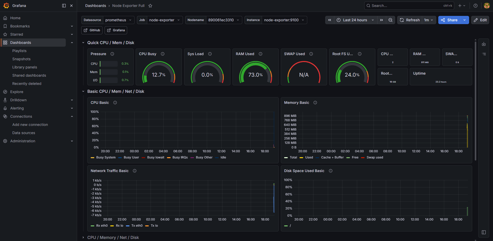
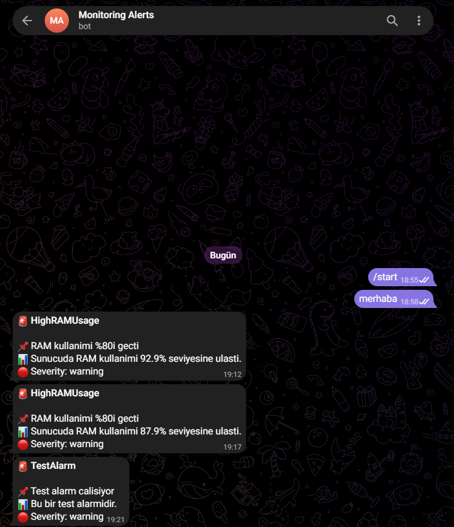

# 🖥️ AWS Server Monitoring Stack

Production-ready monitoring stack deployed on AWS EC2 using Prometheus, Grafana, and Telegram alerting.

## 📊 Architecture
AWS EC2 (Ubuntu 24.04)

└── Docker Compose

├── Prometheus        → Metric collection & storage

├── Node Exporter     → Server metrics (CPU, RAM, Disk)

├── Alertmanager      → Alert routing → Telegram

└── Grafana           → Visualization & dashboards

## 🛠️ Tech Stack

- **Cloud:** AWS EC2
- **Containerization:** Docker, Docker Compose
- **Monitoring:** Prometheus, Node Exporter
- **Visualization:** Grafana
- **Alerting:** Alertmanager + Telegram Bot API

## ⚡ Features

- Real-time CPU, RAM, Disk, and Network monitoring
- Automated Telegram alerts when thresholds are exceeded:
  - 🔴 RAM usage > 80%
  - 🔴 Disk usage > 85%
  - 🔴 CPU usage > 90%
- Pre-built Grafana dashboard (Node Exporter Full)
- Auto-restart on failure with Docker restart policies

## 🚀 Quick Start

1. Clone the repo

```bash
git clone https://github.com/alitosun02/aws-server-monitoring-stack.git
cd aws-server-monitoring-stack
```

2. Copy and fill in your Telegram credentials

```bash
cp alertmanager/alertmanager.yml.example alertmanager/alertmanager.yml
```

3. Start the stack

```bash
docker-compose up -d
```

4. Access Grafana at `http://YOUR_SERVER_IP:3000`
   - Username: `admin`
   - Password: `your_password`

## 📸 Screenshots

### Grafana Dashboard


### Telegram Alerts


## 📁 Project Structure
monitoring-stack/

├── docker-compose.yml

├── prometheus/

│   ├── prometheus.yml

│   └── alert.rules.yml

└── alertmanager/

├── alertmanager.yml.example

└── alertmanager.yml (git ignored)
